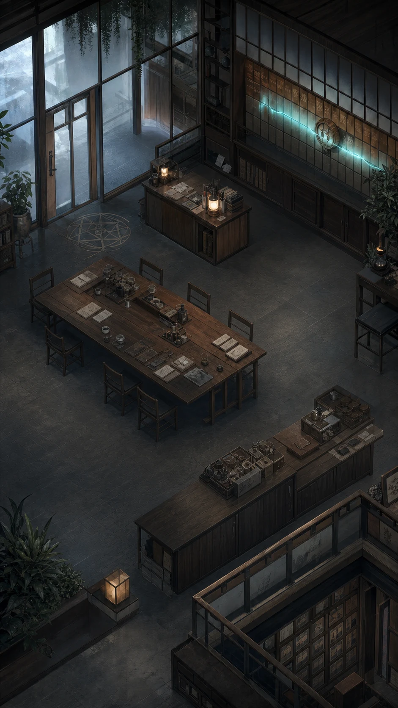

# V4 十分鐘互動原型

_對應 [`product-north-star.md`](./product-north-star.md)；只驗證產品形狀，不驗證完整市場或模型基礎設施_

空場景只定義密度、光線與鏡頭方向。16 位居民、焦點、動作提示、公告和字幕都是獨立圖層，不把含人物的完成圖拿來疊熱區。

## 已落地的驗證版本

2026-07-20 的可操作版本已完成拆層：空場景、16 位人物、焦點、字幕、公告與市場來源各自獨立。人物來自 4 × 4 原創 atlas，但每位居民仍保有自己的 DOM 命中層、姓名顯示與世界座標；跟拍不是在圖片上放固定熱區。

這一版以真實十秒播放十秒，不再把十分鐘壓成一百秒。首訪只在前八秒顯示按住與交接教學；跟拍後，鏡頭推進到人物約佔場景高度 38%，全景姓名與鏡頭外資訊會消失。行情平時只改變牆面脈衝，點開才顯示封存數字與來源。

Web 手勢只負責把螢幕座標換算成世界座標。命中與交接由 [`interaction.ts`](../../apps/web/src/interaction.ts) 的純函式處理，不依賴 DOM 排序、`elementFromPoint` 或 CSS 元件生命週期。

## 要回答的問題

第一版只回答一件事：16 位自主居民在同一個受市場影響的場景裡，觀眾是否願意用「跟拍」連續看十分鐘，並在隔天主動回來找同一個人。

不要在原型裡加入帳號、付費、人物創建、完整命盤、角色檔案、回測或研究頁。這些內容會遮住核心體驗是否成立。

## 固定範圍

- 一個直向手機場景，基準尺寸 390 × 844。
- 16 位成年虛構居民，前景 6 人、中景 6 人、後景 4 人。
- 三檔真實股票的已封存交易日片段。
- 一則帶來源、發布時間與有效時間的真實公告。
- 兩段可聽見的人物對話、一次可觀察的模擬操作，以及一次前後行為不一致但不替人物解釋動機的片段。
- 所有市場資料使用已發生且可核對的歷史片段。原型不偽裝成直播。

## 畫面狀態

### 廣角

相機固定 3/4 俯視。三個自然聚落同時可見，但場景不切頁。市場資訊只改變環境節奏；任何 ticker、漲跌與來源細節都需點開事實物件才顯示。

### 跟拍

按住居民 180 ms 後，相機在 280 ms 內靠近至 3.55 倍，人物約佔場景高度 38%。鏡頭外居民降到 22% 明度；跟拍只保留一段近距收音與一段鏡頭可見動作，不開人物卡或資訊抽屜。

### 交接

按住期間拖向目標人物或物件。進入 44 pt 命中區後，鏡頭重心先偏移，再於 240 ms 內交接。沒有「成功」動畫；交接只代表觀眾改變視角。

### 放開

手指放開後保留目前跟拍對象 800 ms，再平滑退回廣角。快速再次按住可留在同一人身上。觀眾永遠知道自己正在看誰，也知道哪些人仍在畫面外繼續行動。

## 時間腳本

1. 0:00，一個中性音訊提示開盤。三個市場脈衝啟動。
2. 0:20，公告物件進入牆面。四人轉頭，其中兩人拿起裝置，一人故意繼續聊天。
3. 0:35，第一位居民出現短暫停頓，引導光只提醒可按住，不指定要看誰。
4. 1:00–4:00，跟拍者在一人身邊看到市場事實、朋友說法和自我敘述互相打架。
5. 4:00，一位熟人靠近說話。觀眾可交接，也可留在原人身邊；兩個選擇都會錯過另一側的表情與後續。
6. 5:30，另一群人因同產業脈衝被打斷。廣角中可見，但不強制切鏡。
7. 7:00，一人建立模擬部位。畫面只顯示行動、時間與一句當下自述，不顯示建議語氣。
8. 8:00，回到早先人物。鏡頭只呈現他與三分鐘前不同的可見行為，不命名他的內在改變。
9. 9:30，場景留下兩個同時未解的關係張力。沒有摘要、成就或「明日預告」。

## 視覺與聲音原則

- 底色不是通用黑金金融介面。空間以深墨、灰藍自然光、舊紙白與少量氧化銅構成。
- 市場資料使用一個冷色訊號系統；人物關係使用暖色呼吸與空間距離。不要讓紅綠燈號替觀眾判斷好壞。
- 命盤在跟拍時化成構圖偏移、局部陰影、短暫星軌或節律，不常駐一張盤，也不撒滿裝飾粒子。
- 小人必須先靠姿勢、停頓、行走速度和彼此距離說話。文字只補上畫面無法表達的衝突。
- 音效由空間聲、裝置震動、紙張、腳步和低頻市場脈衝構成。不要賭場提示音或報酬慶祝音。

## 真實性標示

跟拍畫面不塞五種標籤。點開單一線索後才顯示其資料身分：`真實資料`、`統計取樣`、`虛構設定`、`象徵解讀`、`模擬敘事`。任何行情或公告都同時顯示來源、時間和原型使用的歷史日期。

## 可及性與替代操作

- 點一下居民後，可用畫面下方的「上一位／下一位／回到全景」完成與拖曳相同的鏡頭操作。
- 螢幕閱讀器以場景、人物、正在注意的物件和聲音來源順序朗讀，不朗讀隱藏心理狀態。
- reduced motion 改用 120 ms 淡入淡出和焦點框，不做鏡頭推拉、視差或星軌。
- 所有居民命中區至少 44 × 44 pt；文字可放大至 200% 而不遮蔽目前跟拍對象。

## 通過條件

- 20/24 無口頭協助完成首次跟拍與一次拖曳交接。
- 10/24 在前景連續看完整個十分鐘。
- 6/24 隔日第一位跟拍者，等於首日跟拍時長第一名。

人物矛盾回憶與事實辨識仍要記錄，用來診斷事件和字幕，但不另立一組會稀釋決策的通過線。三個行為數字任一未達，就回到手勢可發現性、人物辨識、事件密度和資訊代價，不擴充角色數或功能。
