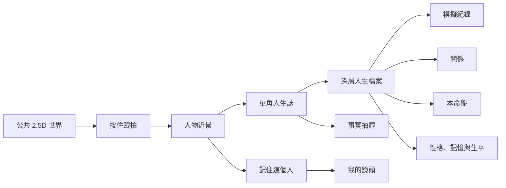

# 《盤勢・眾生》V5 終局產品體驗規格

_2026-07-23｜Status: product direction ready for design and implementation planning_

## 0. 這次修正什麼

V4 證明「跟拍」可以成為公共世界的入口手勢，但把原型的減法誤寫成永久產品邊界。V5 保留跟拍，不再把它當成整個產品。

終局體驗固定為：

> 公共 2.5D 世界 → 跟拍 → 人物近景 → 單角人生誌 → 深層人生檔案

角色的模擬持倉、損益、交易、關係、命盤、記憶與生平全部回來。它們不是首頁儀表板，也不拿來比較誰最會賺；它們是人物說過什麼、做過什麼、付過什麼代價的證據。

V5 取代 V4「角色檔案、持股與績效永遠不出現」的永久禁令。V4 下列成果繼續有效：

- 公共世界是第一個畫面。
- 跟拍有視野代價，觀眾不能同時看見所有人。
- 人物不接受聊天指令、交易指令、照顧數值或重抽。
- 市場事實、人物說法與象徵解讀分開。
- 沒有全球績效榜、模型勝率榜或官方「今日最佳角色」。
- 人物在觀眾離線時繼續生活，既成事件不可回滾。

這份規格描述最終資訊架構。第一批高保真互動稿可以先用 16 位居民驗證畫面密度；真正進入封測時以 50 名完整種子居民開場。引介與有限編導只在同一 cohort 連續 30 個日曆日的 authoring window 開放，最多相交六個 quota windows；60 名測試者用滿額時，capacity／cost qualification 上界是 1,850 名。之後停止新增 authoring quota，完整觀看與世界運行繼續到至少第 30 個完成交易日。所有規模共用同一套導航、角色頁和正式資料形狀。

## 1. 產品承諾

《盤勢・眾生》是一個與真實台股同步的 AI 小人實境世界。觀眾先看見一群人同時生活，再跟著其中一人，看他如何注意、誤解、追高、凹單、改口、後悔，最後把市場輸贏帶回關係和人生。

一句話版本：

> 真實台股是天氣；好看的是這群人怎麼在天氣裡露出自己的樣子。

### 1.1 觀眾為什麼回來

回訪問題必須指向人：

- 他昨天說只做兩天，今天會不會把它改叫長期持有？
- 她明明聽見朋友提醒，為什麼還要裝作沒聽見？
- 他虧掉的只是模擬資產，還是別人對他的信任？
- 同一個毛病已經回來三次，這次他會承認嗎？

使用者可以從股票事件進來，但應該因為人物沒有說完而留下。

### 1.2 「韭菜樣」是可觀察的戲，不是一個分數

角色需要會犯人類熟悉的錯：

- 追高後立刻不安。
- 把短線失敗改稱長期信念。
- 理由已失效，仍因不肯認錯而繼續持有。
- 賺錢歸功自己，虧錢怪市場、朋友或運氣。
- 錯過上漲後被 FOMO 拉回去。
- 嘴上說不在意，卻反覆偷看價格。
- 同一種傷發生過，下一次仍走回原路。

介面不顯示「韭菜指數」「愚蠢值」或人格扣分。它把矛盾並排，讓觀眾自己看懂：

```text
09:12 當時說：「只做兩天反彈。」
第 19 天現在說：「我本來就是看長期。」

模擬損益　−8.4%
小雨曾提醒　1 次
仍未回答　原本的理由還成立嗎？
```

笑點對準人的自我欺騙，不羞辱他的智力、階級、年齡、外貌或人生壓力。可笑和可憐要同時存在；觀眾笑完仍想知道他明天怎麼辦。

### 1.3 每一段韭菜戲都要有骨架

正式故事事件至少保留：

```text
他看見什麼
→ 哪段記憶被勾起
→ 聽了誰
→ 當時怎麼說
→ 做了什麼模擬行動
→ 結果留下什麼
→ 現在如何改口
→ 傷到哪段關係
```

不知道的地方就留白。系統不能為了讓故事完整，替角色補出他沒看過的資料或唯一真因。

## 2. 角色要可愛，但看得出是成年人

可愛感來自輪廓、微表情、動作節奏、生活物件和反差，不來自嬰兒比例或寵物化。

### 2.1 角色外觀

- 世界小人使用 [`visual-system.md`](./visual-system.md) 的 `character.proportion.heads`，維持 2.5D 成人比例。頭部可以略大以便在手機辨識，身體、手腳與服裝仍有成人感。
- 年齡範圍要真的可見。20、35、52、68 歲不能只靠角色卡上的數字區分。
- 每人固定輪廓、髮型、姿勢、主色、常用物件和行走節奏。拿掉名字後仍應認得。
- 成人生活要進入造型：工作鞋、通勤包、老花眼鏡、藥袋、保溫杯、皺掉的襯衫、照顧家人的訊息。
- 不用稀有度、抽卡框、幼齒 chibi、制服戀物或同一張漂亮臉換髮色。

### 2.2 同一個人跨畫面不能變臉

每位角色共用一份 identity master：

| 資產 | 用途 | 必須一致 |
| --- | --- | --- |
| 世界 sprite | 2.5D 群像與跟拍 | 輪廓、髮型、服裝、主色、道具 |
| 近景立繪 | 人物近景 | 年齡、五官、姿勢習慣、當日服裝 |
| 人生誌 4:5 肖像 | 長篇閱讀 | 同一張臉、同一環境線索 |
| 1:1 頭像 | 導航、通知、關係圖 | 不另做美化版 |
| 微動作層 | 眨眼、呼吸、手、道具 | 由正式狀態觸發，不隨機賣萌 |
| 靜態替代圖 | reduced motion、低階裝置 | 保留同一構圖與表情語意 |

世界 sprite 到近景立繪的轉場應讓人感到「走近同一個人」，不能像點開另一張角色卡。

角色與關鍵場景 master 由 Codex 生成圖流程製作，再拆成可控動態層。每份資產保存角色 brief、prompt、negative prompt、seed 或生成識別、工具版本、日期、核准用途、裁切安全區、alt text 與靜態 fallback。圖像模型只決定外觀，不自行增加人物年齡、背景、關係或當日事件。

### 2.3 可愛動作詞彙

允許的細節包括偷瞄手機、杯子停在嘴邊、腳尖抖動、肩膀塌下、假裝整理紙張、訊息打了又刪。大幅跳躍、勝利舞、哭到噴水、金幣噴發不屬於這個世界。

## 3. 資訊架構

每深入一層，資訊才多一點。使用者不必先讀設定，才有資格喜歡一個人。

| 層級 | 使用者心中的問題 | 畫面回答 | 不在這層出現 |
| --- | --- | --- | --- |
| L0 公共世界 | 現在誰有事？ | 人物位置、姿勢、距離、環境變化 | 角色數值牆、績效總覽 |
| L1 跟拍 | 他剛剛看見什麼？ | 近距動作、可聽對話、眼前線索 | 完整背景、全知心理 |
| L2 人物近景 | 他現在卡在哪裡？ | 一個矛盾、一句自述、一個未解後果 | 六個同重量資料模組 |
| L3 單角人生誌 | 他怎麼走到這裡？ | 當日事件、改口、後果、關係波紋 | 全世界排名、模型比較 |
| L4 深層人生檔案 | 有什麼紀錄能證明？ | 模擬持倉、績效、交易、關係、命盤、記憶、生平 | 買賣 CTA、跟單入口 |
| L5 事實抽屜 | 當時資料是什麼？ | 來源、時間、版本、資料身分 | 角色替使用者下結論 |



### 3.1 全站主導航

手機底部固定四項：

1. `世界`：永遠回到公共場景。
2. `我的鏡頭`：固定跟拍、正在追、最近看過。
3. `五幕`：當日最多五段、通過來源與後果檢查的公共故事，不是五支推薦股票。
4. `我的`：通知、權益、資料與可及性設定。

收藏片段與觀眾整理的故事卷放在「我的」。`引介居民` 放在「我的鏡頭」內，不占公共世界主導航。績效、持股與交易沒有全站入口，只能從某一位人物進入。

桌面版把同四項放在窄側欄。場景開啟時導覽縮成圖示加可讀標籤，不用沉浸模式把返回路徑藏掉。

### 3.2 角色內導航

人物近景只有兩個主要動作：

- `翻開今天的人生誌`
- `回到世界`

人生誌底部才出現 `打開完整人生檔案`。人生檔案的索引固定為：

- `模擬紀錄`
- `關係`
- `本命盤`
- `性格與習慣`
- `記憶`
- `生平`

「模擬紀錄」再包含持倉、績效與交易。這三者不平鋪在人物首頁。

### 3.3 深連結與返回

- 分享人物時，未登入者先到人物近景，不先遇到註冊牆。
- 分享單一故事時，先開人生誌對應段落，上方提供 `回到那天的世界`。
- 分享交易後果時，先顯示故事句，再展開模擬紀錄；不能只生成報酬截圖。
- 從深層檔案返回，回到人生誌原捲動位置。
- 從人物近景返回世界，相機回到該人物最後可知位置；角色已離場時，回到場景並說明去向。

### 3.4 正式公開網址

- 唯一 canonical public origin 是 `https://panshi.app`；所有人物、章節、分享卡、短影音返回與登入完成網址都使用 apex domain。
- `https://www.panshi.app/*` 以永久重新導向保留原 path 與 query 到 apex；不能形成第二套 canonical URL、cookie scope 或分析 session。
- 正式 Web API 對瀏覽器只公開同源的 `/api/v2/*`。內部 service、object storage 與模型 gateway 的 hostname 不出現在頁面、分享、錯誤訊息或公開文件。
- 角色與故事 deep link 使用穩定 opaque ID，不含股票推薦語、角色績效或可推回帳號身分的資料。
- 保留 `/.well-known/apple-app-site-association` 與 `/.well-known/assetlinks.json`，讓日後原生 App 能承接同一條人物與章節連結，而不是建立另一套路由。
- 舊研究入口不取得首頁 canonical、搜尋索引或登入 callback 身分。若需保留，只能作明確標示、不可索引、與正式帳號及正史隔離的歷史路徑。

## 4. 第一次使用：先跟上一個人，再談帳號

首訪不用登入，不播品牌影片，不要求選股票、選人格或讀玩法說明。它是由正史狀態驅動的路徑，不是按秒排好的演出；系統不能為了教學替角色製造一筆交易、一句改口、一次相遇或一個結果。

| 狀態 | 畫面與動作 | 體驗目的 |
| --- | --- | --- |
| `WORLD_ENTERED` | 公共世界直接運行。短提示：「按住一個人，跟他走一段。」 | 先知道這裡有人活著 |
| `CHARACTER_FOLLOWED` | 鏡頭靠近，只呈現此刻已可公開的注意、姿勢、聲音與關係距離。 | 看懂他現在在意什麼 |
| `CURRENT_TENSION_SEEN` | 人物旁出現 `再靠近一點`，進入近景。若此刻沒有事件，安靜與等待本身可以成立。 | 從群像走到一個人 |
| `PAST_EPISODE_AVAILABLE` | 顯示 `看他怎麼走到這裡`。開啟最近一段已發布、已通過市場 finality 的人物章節，標示實際發生時間與 `回看`。 | 證明人物有不可改寫的歷史 |
| `PAST_EPISODE_UNAVAILABLE` | 近景如實顯示 `他的故事才剛開始`；可以回到世界，或前往一名確實已有完整章節的居民。 | 不拿虛構後果補空白 |
| `JOURNAL_OPENED` | 人生誌只顯示正史中已有的說法、行動、紙上代價與關係後果；尚未發生者明確標成未完。 | 讓轉換發生在故事之後 |

回看不會把世界倒帶。章節上方固定顯示 `回看・YYYY/MM/DD HH:mm`，返回後回到現在的世界時間。市場開盤中若當日行動尚未通過 finality，首訪只能看到中性當下狀態與前一有效交易日以前的章節。

### 4.1 首訪教學規則

- 每個提示只出現一次；成功後永久收起。
- 教學描述手勢，不指定要跟誰。
- 不畫箭頭追著人物跑。
- 使用者沒有跟拍，也能點一下角色後選 `開始跟拍`。
- 教學 selector 只能引用已存在的公開角色與章節，不能建立 per-user encounter、speech、paper action 或 story beat。
- `再靠近一點` 在看懂一個當下狀態後即可出現，不以角色先完成交易或說出矛盾話語為前提。
- 歷史章節必須清楚標成回看；回看時產生的觀看、追蹤與收藏不能回寫角色當時的注意或決策。
- 註冊牆只能在「記住人物、收藏片段、設定提醒、引介居民」時出現。
- 關閉註冊牆後回到原故事位置，不清空觀看進度。

### 4.2 首次成功定義

第一次使用不以註冊或付費計算成功。90 秒目標只衡量理解與抵達，不承諾世界在 90 秒內替他演出一筆新交易。使用者必須完成：

1. 跟拍一人。
2. 能回答他此刻在意什麼，或說出他正在等待什麼。
3. 進入同一人的近景。
4. 若該人已有完整正史，打開一段標示為回看的已完成章節；若沒有，能辨認故事仍未產生結果。

「看見一次改口或紙上後果」是首個完整故事的內容目標，不是每位角色、每次首訪都必須即時觸發的系統前置條件。

## 5. 公共 2.5D 世界

### 5.1 畫面組成

手機是 3/4 俯視的直向場景。第一個街區仍可使用「開盤廳」，但它是世界的一個地點，不是整個產品。

畫面同時容納：

- 高細節居民、邊緣剪影與視野總量只讀 `world.residents.high_detail`、`world.residents.edge_silhouette`、`world.residents.total_max`。
- 前、中、後三層活動。
- 自然聚落數使用 `world.clusters.natural`。
- 一個可見但不搶戲的市場環境面。
- 角色能碰觸的生活物件。
- 場景時間、資料截至時間與連線狀態。

市場變化先影響空間：抬頭人數、說話中斷、螢幕節奏、走動方向。Ticker、漲跌、來源只有點開事實物件才顯示。

### 5.2 世界不替觀眾選主角

- 不放「今日主角」或自動切鏡。
- 不因某人賺最多就加光圈。
- 可以用自然表演提升可發現性，例如一個杯子掉下來、兩人突然沉默。
- 同時最多兩個事件有明顯聲畫優先權，避免每個人都在演。
- 背景人物即使沒被跟拍，也要維持有脈絡的動作。

### 5.3 場景時間

公共世界隨台灣市場與人物生活切換：

| 時段 | 空間重點 | 人物重點 |
| --- | --- | --- |
| 盤前 | 通勤、整理資料、隔夜訊息 | 誰先看見、誰還沒醒 |
| 盤中 | 中斷、等待、偷看、交談 | 注意如何被拉走 |
| 收盤後 | 數字停止，動作放慢 | 誰改口、誰先離開 |
| 夜間 | 住家、咖啡店、屋頂、訊息 | 關係、反省、逃避 |
| 休市日 | 沒有虛構行情脈衝 | 生活、工作、舊事與週回顧 |

休市日仍有故事，但不能製造不存在的即時行情。

### 5.4 今日五幕

`今日五幕` 是公共世界的故事索引與品牌名稱，不是自動播放的官方主戲，也不是固定產量。每個交易日目標選出最多五段人物後果完整的公共章節；只有 0–4 段通過來源、後果與發布檢查時，就照實顯示：

- 標題先寫人物矛盾，不先寫股票。
- 每幕至少有一個真實市場事件、一名受影響居民和一個未完人物後果。
- 可以是一人獨處，也可以是一段關係；不要求每幕都有成交。
- 入選依關係變化、改口、承諾、紙上代價和跨日連續性，不依報酬幅度。
- 使用者可從五幕走回當時場景、人物近景和人生誌，也能完全忽略索引，自行在世界找人。

數量文案：

```text
今天有三幕值得留下
今天沒有硬湊一幕，去世界裡看看誰還在嘴硬
```

API、空狀態、骨架與分析事件都接受 0–5 幕。不能建立沒有來源、沒有可核對漲跌後果或只有模型形容詞的佔位故事。

範例：

> 她昨天勸別人別追，今天自己追進去了。

不能寫：

> 今日值得關注：某公司。

## 6. 跟拍

### 6.1 主要手勢

- 按住居民達 `gesture.follow_hold`：開始跟拍。
- 鏡頭以 `camera.follow_in` 推近，人物尺寸使用 `camera.follow_subject_height`。
- 保持按住並拖向他正在注意的人：以 `camera.follow_handoff` 交接鏡頭。
- 放開：依 `camera.follow_release_hold` 保留目前人物，再回到全景。
- 回到全景後，剛跟拍人物旁依 `camera.closeup_cta_persist` 保留 `再靠近一點` 入口。

點一下居民則開啟選取列：

```text
[開始跟拍] [看他的近況] [取消]
```

這是鍵盤、螢幕閱讀器、Switch Control 與不方便長按者的等價操作，不是較低階版本。

### 6.2 跟拍畫面可見內容

只顯示鏡頭能知道的東西：

- 人物姓名和一個當下動詞，例如「正在假裝整理筆記」。
- 若存在已封存且通過可見性政策的 `UtteranceArtifactV1`，顯示一整句可聽見原話；否則不補台詞。
- 他正在看的物件或人。
- 若存在 `SELF_ACKNOWLEDGED` artifact，顯示一個短暫自我敘述；它可以不可靠，但不能由系統臨時代寫。
- 事實物件的來源入口。
- `再靠近一點`，在使用者已看懂一個投影中的當下狀態後出現；動作、等待或安靜都算，不要求新事件。

不顯示完整人格值、隱藏動機、持股明細或一長段模型文字。

### 6.3 跟拍的資訊代價

近景時，鏡頭外居民降到 22% 明度，遠處字幕與姓名退場。聲音也依距離收窄。觀眾知道別處仍在發生事情，但不能用縮圖同時監看。

離開跟拍後，不提供全知倒帶。已公開的正式故事會進人生誌；沒被任何可驗證事件留下的細節，不補成答案。

## 7. 人物近景

人物近景不是資料卡，是一個短場景。它應在 10 秒內回答：「這個人現在怎麼了？」

### 7.1 手機構圖

1. 上方 55–60%：角色 4:5 近景、環境與一個持續微動作。
2. 中段：姓名、年齡、職業和當下動詞。
3. 主句：一句尚未解決的矛盾。
4. 後果碎片：只顯示與當下故事直接相關的一項模擬後果或關係變化。
5. 主動作：`翻開今天的人生誌`。
6. 次動作：`回到世界`、`記住這個人`。

範例：

```text
陸硯之，28 歲
正在偷看他說不在意的價格

他昨天說，只做兩天。
今天是第十九天。

模擬損益 −8.4%　小雨已經不再提醒
紙上資料截至前一交易日收盤

[翻開今天的人生誌]
```

### 7.2 近景的揭露節奏

- 先依 `motion.closeup_action_lead` 看動作，再出文字。
- 名字先出，數值後出。
- 人物說法與產品旁白分開排版。
- 模擬損益只在它是這一幕的後果時出現。
- 每個紙上數字旁必須顯示 `as_of`。盤中一律是「截至前一交易日收盤」；「今天追進／減碼／成交」及同日 ticker、方向、數量、理由，只能在 `MarketSessionFinalityAccepted` 後的盤後回顧出現。
- 沒有模擬部位時，改顯示工作、關係或記憶後果，不能硬塞空績效。

## 8. 單角人生誌

人生誌是核心留存頁。它不是角色百科，也不是 AI 自動日記全文；它把正式事件編成可回看的連續人生。

### 8.1 預設順序

每一日依序呈現：

1. `今天他怎麼了`：一張場景、時間與一句現況。
2. `他當時怎麼說`：原始自述，不事後改寫。
3. `他其實知道什麼`：只放角色當時接觸過的材料。
4. `他漏掉了什麼`：收盤或資料公開後才可顯示。
5. `他做了什麼`：模擬行動、等待、求助、隱瞞或退出。
6. `這個決定留下什麼`：損益、時間、工作、關係或自我信任。
7. `現在怎麼說`：後來的自述。
8. `老毛病又回來了`：只有同類模式至少發生兩次才出現。
9. `還沒完`：下一個未解問題，不預告結果。

若內在動機尚未被角色承認，介面寫 `暫時不知道`，不顯示第三人稱全知答案。

### 8.2 三層聲音

人生誌可同時保存，但不必同時揭露：

| 聲音 | 範例 | 揭露條件 |
| --- | --- | --- |
| 對外說的話 | 「資料還不完整，先不下結論。」 | 當場可聽 |
| 他知道自己在想的事 | 「我是不是又漏看了？」 | 正式反思或私人紀錄已發生 |
| 他尚未承認的事 | `暫時不知道` | 舊節點永遠維持未知；若後來出現 `SELF_ACKNOWLEDGED` artifact，依它自己的 world time 新增後續節點，不倒灌回填 |

產品旁白可以指出矛盾，不能替人物診斷：

```text
他說自己不在意。
接下來 17 分鐘，他看了六次。
```

### 8.3 跨日閱讀

- 預設打開「今天」，往下是昨天與更早事件。
- 一個故事跨日時，用同一條窄銅線串起，不拆成重複貼文。
- 使用者離開後再次回來，回到最新未讀節點，不跳到頁首。
- `從頭看這段` 只回放已公開節點，不重播世界或改寫結果。
- 每段事件可收藏；收藏只保存完整 public segment ref、source event refs、artifact ID／hash 與當時 projection version，不複製當下文字。原內容撤下時收藏同步 tombstone。

### 8.4 人生誌中的績效

績效只出現在它回答人物後果時：

```text
這個決定留下什麼

模擬部位仍在
持有 19 天
未實現損益 −8.4%

原始理由（系統摘要）：兩天內等反彈。
現在原話（13:22）：「這家公司值得長期看。」

[看完整模擬紀錄]
```

「現在原話」只有在該句存在可見 `UtteranceArtifactV1` 時出現；否則和原始理由一樣使用無引號摘要。

不能在不同角色間排序，也不提供「最會賺」「勝率最高」「最佳思考核心」。

## 9. 深層人生檔案

深層人生檔案是某一個人的完整「可發布紀錄」。入口只在人生誌底部和人物近景的更多選單。它不是內部 prompt、chain-of-thought、未發布候選記憶或引介人專屬真相。

可見邊界固定為：

- 匿名與所有方案都看得到今日場景和最新公開後果。
- Free 看最近 30 日人生誌、最近 30 日模擬紀錄和公開精選。
- Pro 看完整可發布歷史、完整紙上帳本投影及關係／命盤／性格／記憶／生平證據。
- 正史限制資料不因付費或引介關係曝光。

同一角色對所有 Pro 顯示相同事實。引介人多的是創作與整理工具，不是角色的獨家內心。

### 9.1 檔案首頁

檔案首頁不是卡片牆。它像一本有索引的長期人物誌：

1. 人物肖像與一句長期自我矛盾。
2. `最近留下的三件事`。
3. `模擬紀錄`。
4. `關係`。
5. `本命盤`。
6. `性格與習慣`。
7. `記憶`。
8. `生平`。
9. 資料身分與版本入口。

每個索引項顯示一句具體摘要：

```text
模擬紀錄
目前 2 個部位，其中 1 個理由已失效。

關係
小雨的信任下降；老貓最近反而常來找他。

本命盤
「控制與責任」最近三次被同類事件喚起。

性格與習慣
他自稱只相信證據，卻連續兩次跟著熟人改變看法。
```

### 9.2 模擬持倉

持倉頁的閱讀順序固定：

1. 他為什麼建立這個部位。
2. 當時看見哪些資料。
3. 開始時間、模擬價格與標準化部位。
4. 目前或結束損益。
5. 原始失效條件是否已發生。
6. 他現在怎麼說。
7. 誰曾影響他。
8. 這件事改變了什麼。

列表欄位：

| 欄位 | 顯示方式 |
| --- | --- |
| 公司 | 名稱、代號；不做推薦標章 |
| 狀態 | 模擬持有／已結束／等待 |
| 時間 | 建立、最後變更、結束 |
| 價格 | 模擬成交與資料時間 |
| 損益 | 金額、百分比、正負號與文字，不只靠顏色 |
| 當時理由 | 當時封存的結構化理由摘要；不用引號 |
| 失效條件 | 未發生／已發生／當時未知 |
| 同時原話 | 若當時另有可見 `UtteranceArtifactV1`，才逐字顯示；沒有就留白 |
| 現在說法 | 最新正式自述；只逐字引用已封存 artifact |

空狀態：

> 他目前沒有模擬持倉。沒下手，也是今天的一部分。

### 9.3 模擬績效

績效頁只回答「這個人一路承受了什麼」，不回答「誰最好」。

必須包含：

- 累積模擬資產曲線。
- 已實現與未實現損益。
- 期間切換：`近 1 月`、`近 3 月`、`全部`。
- 成本與計算方式。
- 最大連續失利、最長持有、最常改口的部位。
- 曲線上的人物事件標記。
- 盈利與虧損完整保留，不預設只看最好區間。

曲線上點一個節點，先顯示人物句：

> 這一天，他第一次把「我看錯了」說出口。

再顯示數字與交易。分享績效時，輸出必須同時帶人物、期間和至少一項後果，不提供只有報酬率的乾淨圖卡。

禁止：

- 全球或好友績效榜。
- 按報酬排序居民。
- AI 核心報酬比較。
- 勝率徽章、冠軍框、連勝慶祝。
- 用績效決定角色稀有度、畫質或曝光。

### 9.4 交易紀錄

交易紀錄是按時間排序的紙上帳簿：

```text
09:17　建立模擬部位
09:18　系統摘要：當時理由是兩天內的反彈
第 3 天　失效條件出現
第 5 天　沒有結束；第一次改口
第 19 天　仍持有
```

每筆可展開：

- 模擬數量、價格、成本與資料時間。
- 行動前封存的結構化理由摘要。
- 若行動前另有可見的正式原話，逐字引用同一 `UtteranceArtifactV1`；沒有 artifact 就不補一句第一人稱台詞。
- 當時可取得的事實。
- 角色沒有看到的事實。
- 相關記憶與關係影響。
- 事後反思和後續修正。

不顯示即時他人交易快訊。盤中只顯示截至前一有效交易日收盤的公開持股；人物當日的 ticker、方向、數量、信心與精確紀錄，要等市場收盤、資料 finality 通過並形成盤後章節後才進入檔案。完整時序以 [`market-safety.md`](./market-safety.md) 為準。

### 9.5 關係

桌面可使用關係圖；手機預設用人物列表和最近事件，不強迫在小螢幕捏縮放。

每段關係顯示：

- 他們怎麼認識。
- 現在相處的樣子。
- 信任、依賴、競爭、虧欠等可讀描述。
- 最近三個讓關係改變的事件。
- 雙方對同一事件不同的說法。
- 尚未說出口的部分只能標 `未知`。

不顯示單一「好感度 +23」。若內部有數值，前端轉成有門檻和證據的描述，例如：

> 小雨仍信任他的研究，但已不再提醒第二次。

### 9.6 本命盤

本命盤提供完整固定盤面、出生資料的虛構身分、象徵主題和過去被喚起的故事。

資訊順序：

1. 完整盤面。
2. 太陽、月亮、上升與主要相位。
3. 反覆出現的象徵主題。
4. 這些主題曾在哪些人生事件出現。
5. 最近一次象徵解讀。

文案描述注意、信任、衝突和私人意義，不把命盤接成價格方向。

範例：

> 「控制與責任」是他反覆回來的題目。這次，它讓他比平常更難承認資料不足。

### 9.7 性格與習慣

性格頁不放 MBTI 四字母或能力雷達圖。它用連續的「四軸性格偏好」、核心需要、常見認知偏誤和實際事件互相對照：

| 區塊 | 呈現 |
| --- | --- |
| 四軸性格偏好 | 內省 ↔ 外顯、具體 ↔ 抽象、關係 ↔ 分析、彈性 ↔ 結構 |
| 核心需要 | 安全、控制、歸屬、地位、好奇、被理解、證明自己 |
| 容易出現的偏誤 | 只顯示已有事件證據的傾向 |
| 他怎麼形容自己 | 角色自己的說法 |
| 世界實際留下什麼 | 至少兩件可回看事件 |
| 血型自我敘事 | 只作文化認同與社交語氣，不當能力判斷 |

每個軸都能打開例子：

> 他說自己偏向分析。最近兩次壓力升高時，他仍先問了最信任的人，再回頭找證據。

性格偏好是理解入口，不是固定命運。當日情緒、疲勞、記憶與關係可以讓他做出不典型行動；頁面要保留這些反例。

### 9.8 記憶

記憶依「人物記得的方式」呈現，不假裝是監視器：

- 發生時間。
- 涉及人物。
- 當時情緒。
- 現在如何理解。
- 記憶可信度。
- 曾被哪些新事件喚起。
- 是否已被後來經驗改寫。

同一記憶的新舊版本並排，不覆蓋：

```text
以前記得：「父親什麼都沒有說。」
現在記得：「他其實說過，只是我當時不想聽。」
```

### 9.9 生平

生平把統計取樣、真實世代背景與虛構人生分開：

- 出生與成長地。
- 家庭結構。
- 教育與職涯。
- 生活責任與經濟壓力。
- 重大虛構人生事件。
- 加入公共世界後的 canonical history。

生平先讀故事，再展開資料身分。不能只用 MBTI、星座、血型和職業四個標籤概括一個人。

### 9.10 資料身分

深層檔案與事實抽屜使用同一組標籤：

- `真實資料`
- `統計取樣`
- `虛構設定`
- `象徵解讀`
- `模擬敘事`

標籤平時以小圖形加短詞顯示，點開才看說明、時間與版本。市場數字和公告要顯示來源；角色說法要清楚標為角色說法。

## 10. 訂閱者的有限創作權

訂閱者可以讓新人物走進世界、長期追蹤居民，也能有限度地安排故事條件。這些權利改變誰有機會相遇、接觸哪份已公開材料，或被哪個問題打斷，不改寫人物的意志與結果。

### 10.1 訂閱者可以做

- 每週最多引介五位新居民。
- 每次引介選擇一個人生階段、一個背景主題、一個研究傾向、一句人生誓言與一個思考核心。
- 追蹤居民並設定人物出場提醒；Pro 的追蹤數量不設產品上限，但受合理使用與通知頻率限制。
- 每週使用三次有限編導：安排兩名已引介居民在公共地點相遇、把一份已封存公開材料放進一人的可接觸環境，或留下一個生活／研究問題進入候選注意佇列。
- 收藏跨日片段。
- 把 canonical 片段整理成自己的故事卷，撰寫觀眾札記。
- 分享故事卷；札記明確標為觀眾觀點，不進人物記憶。

### 10.2 訂閱者不能做

- 選公司、買賣方向、模擬金額或行動結果。
- 對人物輸入聊天 prompt、命令或暗示。
- 改姓名、年齡、外貌、命盤、人格、記憶或關係。
- 重抽不喜歡的人生。
- 重跑虧損、刪除丟臉事件或選較有利版本。
- 用付費取得較早的市場資訊或角色行動。
- 讓思考核心變成報酬加成。
- 指定有限編導一定發生、人物一定接收，或人物一定依照問題採取行動。

### 10.3 引介流程

```text
我的鏡頭
→ 引介新居民
→ 了解本週剩餘次數
→ 選人生階段、背景主題、研究傾向與人生誓言
→ 選思考核心
→ 預覽核心的取捨
→ 確認「人物醒來後不可重抽」
→ 系統保留一個本週名額，先確認能長期承接這位居民
→ capacity 通過後建立固定虛構人生與命盤
→ 同一人物的肖像、世界 rig、表情、裁切與替代文字通過檢查
→ 所有建立檢查完成後，保留名額轉成已使用並建立引介關係
→ 新居民在下一個有效世界節點入場；此後不再有 business reject
→ 觀看第一幕
→ 選擇是否追蹤
```

入口文案：

> 你決定讓他走進來，不決定他會成為誰。

確認文案：

> 這位居民醒來後，人生、命盤和第一段記憶就會固定。往後發生的好事與丟臉事都會留下。

按鈕：

```text
[讓他走進世界]
[先不要]
```

系統只在 origin、成人／真人相似、內容、權利、完整資產與長期容量全部通過後，才把引介次數從「保留中」轉成「已使用」。轉換後只剩不可拒絕的 arrival finalize；錯過世界節點或網路中斷只會等待／重試同一人物。建立期間不能同時送出超過剩餘名額；離開後可回到同一個 pending introduction，不能因重新整理、暫時失敗或跨週得到另一位候選人。

若長期容量暫時不足，人物還不出生，名額維持保留但不計為已使用。狀態寫：

> 世界正在替這位居民留位置。現在還沒有封存他的人生；位置準備好後，會接著完成同一份引介。

此時可以離開、查看進度或撤回尚未封存的人物；不能重送同一 request 取得多個候選。產品若無法在承諾時間內提供位置，必須停止接受新的付費引介，而不是讓已公開居民停止生活。

人生封存後，文案明說：

> 他的人生已經固定，外觀和世界動作還在做最後檢查。離開也沒關係。

暫時生成失敗只重試同一人物與同一外觀 seed。只有年齡、真人相似、內容安全、權利或不可修復資料錯誤才終止並釋放名額；使用者不能主動取消已封存人生來重抽。

四個人物起點只提供少量、互斥且可理解的選項，不出現人格滑桿、星盤微調或背景全文編輯。系統依選擇和統計約束生成其餘人生；確認後不能預覽多個候選再挑最好看的。

### 10.4 思考核心

使用者看到的是取捨，不是智力高低：

| 核心 | 介面描述 |
| --- | --- |
| 平衡觀察 | 看得穩，改變看法的速度也適中 |
| 深讀慢想 | 會找更多矛盾，但常常晚一步 |
| 快看快答 | 反應快，容易太早相信第一個答案 |
| 群體感應 | 很會聽人，也更容易跟著人走 |

上表是行為取捨語言，不是四個可直接上線的假模型。思考核心選擇頁的每個選項都必須有已核准的 `coreId`、公開模型名稱、行為契約與 snapshot policy。封測預設為 `Gemma 4 26B・平衡觀察`；至少兩個核心通過同一組測試後才顯示選擇器。只有一個核心可用時，頁面寫「這次使用 Gemma 4 26B・平衡觀察」，不顯示不可選的卡片。

人物介紹只顯示核心名稱與閱讀／反應特徵，績效頁不拿核心當解釋勝負的標籤。精確 snapshot、prompt、政策與版本留在事件紀錄；非公開運算來源不出現在產品、repo 或分享內容。

### 10.5 三種有限編導

每週共用三次額度，每次只能選一種：

| 類型 | 使用者設定 | Validation／排程 | 角色仍可怎麼做 |
| --- | --- | --- | --- |
| 安排相遇 | 兩名已引介居民、一個可用公共地點 | Validation 可拒絕；accepted 後只能安排、延後、到期、作廢或呈現前撤回 | 見面後仍可沉默、離開或談別的事 |
| 放入材料 | 一份已封存公開材料、一名居民可接觸的環境 | Validation 可拒絕；accepted 後只能安排、延後、到期、作廢或呈現前撤回 | 可能看見、只看標題、漏看或轉述給別人 |
| 留下問題 | 選擇版本化問題模板、生活主題、可選封存材料與時間範圍 | Validation 可拒絕；accepted 後只把同一 normalized seed 放入候選排程 | 可以忽略、誤解、延後或拒絕回答 |

介面不提供自由文字欄。問題 payload 固定為 `question_template_id` 加白名單 categorical slots；可選材料只能是已封存公開 ref，時間只能從政策提供的範圍選。問題先經安全、公司方向、個資與市場指令檢查，不能包含買進、賣出、目標價、部位、情緒、關係結果或要求回答的期限。觀眾自己的札記另存在 Viewer Library，不送進角色。

政策拒絕發生在 validation 階段不扣，但畫面要等 `QuotaReservationReleased` acknowledgement 後才把次數加回；技術問題只維持 pending，不讓使用者換一份重送。Quota acknowledgement 一旦完成，World 只能把同一份 normalized seed finalize 成 accepted；後續延後、期限到期、權利撤回造成的作廢，或使用者在呈現前撤回都仍算一次，不能用重送換結果。

回饋文案：

> 你把條件放進世界。接下來怎麼走，是他們的事。

### 10.6 故事卷

故事卷讓訂閱者有作者感，但不改世界正史：

- 從已公開事件選 3–12 個片段。
- 可命名、排序閱讀順序、寫一段觀眾札記。
- 每個片段保留原時間與人物說法。
- 不可剪掉句子的一半、改台詞或假造時間順序。
- 發布後顯示 `觀眾整理`；人物不會知道，也不會受影響。

## 11. Free、Pro、失訂與封測

### 11.1 權益矩陣

| 能力 | Free | Pro | 失訂後 |
| --- | --- | --- | --- |
| 觀看公共世界 | 完整 | 完整 | 完整 |
| 跟拍任何公開人物 | 完整 | 完整 | 完整 |
| 人物近景 | 完整 | 完整 | 完整 |
| 今日人生誌 | 完整 | 完整 | 完整 |
| 最近 30 日公開人生誌 | 完整 | 完整 | 完整 |
| 精選長期章節 | 完整 | 完整 | 完整 |
| 最近 30 日模擬持倉、績效與交易 | 完整 | 完整 | 完整 |
| 30 日前完整模擬歷史 | 精選 | 完整 | 精選 |
| 完整關係、命盤、性格、記憶與生平 | 試讀 | 完整 | 試讀 |
| 追蹤居民 | 3 人 | 不限合理使用 | 3 人 |
| 出場提醒 | 1 人、每日彙整 | 可個別設定 | 1 人、每日彙整 |
| 收藏片段 | 最多 10 段 active／可新增 | 不限合理使用 | 既有全部唯讀；降到 10 段前不可新增 |
| 建立故事卷 | 不可 | 可 | 已建立者唯讀、可匯出 |
| 每週引介 | 不可 | 5 次 | 不可 |
| 每週有限編導 | 不可 | 3 次 | 不可 |
| 廣告 | 註冊後前 30 日無；之後有 | 無 | 依 Free 規則 |

Free 仍要看得懂完整一幕，包括角色做了什麼和最近一次後果。不能把故事的結尾切掉，再把「他到底賠多少」當付費誘餌。Pro 賣的是長期觀看、完整檔案和有限創作權。

### 11.2 Free 旅程

```text
看公共世界
→ 跟拍一人
→ 打開近景與今日人生誌
→ 看見最新模擬後果
→ 記住一人
→ 隔日從「我的鏡頭」回來
→ 需要完整長期檔案、更多追蹤或有限編導時，再看 Pro
```

Free 不需要先建立人物，也沒有每日觀看次數限制。

### 11.3 Pro 旅程

```text
完成一段人物故事
→ 記住這個人
→ 收到人物出場提醒
→ 看完整人生檔案
→ 週末引介新居民
→ 隔日觀看他的第一個自主選擇
→ 安排一次相遇、公開材料或問題
→ 收藏跨日片段
→ 整理成故事卷
```

升級入口只在使用者主動碰到 Pro 能力時出現。方案頁先列功能和計費週期，不用倒數、假名額或角色求救。

### 11.4 Pro 方案頁與結帳

正式版只有一個 Pro：

| 週期 | 顯示價格 | 說明 |
| --- | ---: | --- |
| 月繳 | NT$329／月 | 每月續訂，可隨時取消下期 |
| 年繳 | NT$2,790／年 | 約比連續月繳少 29% |

方案頁由上而下只回答四件事：

1. Pro 多了什麼：完整人生、每週五次引介、三次有限編導、完整追蹤工具與免廣告。
2. Pro 沒買到什麼：不能控制角色、不能改交易、不能提早看市場事實。
3. 退訂後怎麼辦：角色繼續生活，歷史不刪；帳號先按 Free 範圍查看，恢復 Pro 後完整可發布檔案復原。
4. 今天會扣多少、何時續訂、在哪裡取消。

價格必須由簽章後的 price catalog 與商店回傳值呈現，不能寫死在 client。Web 顯示含稅總價；App Store 若使用鄰近合法價格級距，以商店畫面為準，權益不變。付款失敗、等待商店確認、重複 webhook、grace、退款、到期與恢復都各有明確狀態，不能先開權再於 client 補驗。

帳號前 30 日免廣告不是 Pro 試用，不綁卡、不會自動續訂。封測顯示相同權益比較，但不顯示可扣款按鈕，改為：

> 封測期間，完整權限已經替你打開。這次不會扣款，也不會開始試用倒數。

正式按鈕：

```text
[年繳 NT$2,790]
[月繳 NT$329]
[繼續免費看]
```

禁止：

- 預先勾選方案或把年繳偽裝成月費。
- 用角色求救、失聯、受傷或績效製造付款壓力。
- 把廣告剩餘天數寫成 Pro 試用倒數。
- 用較好的模型、紙上本金或市場資訊推動升級。

### 11.5 失訂旅程

```text
Pro 到期
→ 帳號回到 Free
→ 主動引介、有限編導與故事卷編輯停止
→ 所有舊追蹤仍可找到，個別提醒先暫停
→ 使用者自行選最多三人作為 Free active follows
→ 只替其中一人恢復每日彙整提醒；系統不自動替他選
→ 超過十段的收藏和既有故事卷保留唯讀
→ 所有居民繼續在公共世界生活
→ 原引介紀錄與歷史不刪；依 Free 範圍顯示，既有故事卷保留唯讀
→ 使用者可從「以前固定的人」逐一找到他們
→ 恢復 Pro 後，完整可發布檔案、原引介關係、追蹤清單、收藏和提醒恢復
```

失訂文案：

> 他們沒有消失，也沒有停在你離開的那天。你仍可在公開世界找到他們。

按鈕：

```text
[去找他們]
[重新查看 Pro]
```

沒有「贖回角色」。失訂期間形成的關係、記憶、損益和丟臉事件全部保留。

### 11.6 廣告節奏

匿名訪客的第一段完整故事不顯示廣告；繼續匿名觀看後，廣告只能放在完整故事結束的自然換場。建立帳號後重新開始獨立的 30 個日曆日免廣告期；其後 Free 使用相同換場規則。Pro 與 `beta_full_access` 不顯示廣告。

- 不插進跟拍、人物說話、人生誌段落或模擬後果之間。
- 節目間長版廣告為 45–90 秒；進場前清楚顯示實際長度、靜音與返回方式。
- 返回後回到同一捲動位置與世界時間。
- 每次使用最多在兩個自然換場出現，頻率由遠端設定但有產品上限。
- 錯誤、資料延遲、訂閱狀態變更後不接廣告。

Free 永久可看產品選定的「公開精選」，但廣告不解鎖 30 日前的其他章節，
也不產生暫時 archive grant。關閉、播完或播放失敗都只影響該次廣告，
不改 entitlement、角色世界、較早市場事實或任何交易優勢。

封測固定使用 `beta_full_access`。金流、試用倒數與廣告 SDK 關閉；測試 entitlement 仍要走同一套畫面和狀態。

## 12. 每日與每週節奏

節奏提供回來的理由，不是待辦清單。任何節點都不能保證市場會給出戲劇性結果。

### 12.1 每日

| 時間 | 世界發生什麼 | 回訪入口 |
| --- | --- | --- |
| 07:00–08:30 | 起床、通勤、昨夜關係餘波 | `你離開後，他先做了什麼` |
| 08:30–09:00 | 公開資訊進場，注意開始分流 | 盤前場景，不發買賣提示 |
| 09:00–13:30 | 研究、交談、等待、模擬行動 | 跟拍現場；精確故事按封存規則公開 |
| 13:30–16:00 | 市場結果固定，人物開始改口或沉默 | `收盤後，他第一句說什麼` |
| 18:00–22:30 | 工作與關係後果 | 夜間場景、人生誌新節點 |
| 23:30 | 當日正式事件入誌 | `今天留下的三件事`，不是績效日榜 |

預設通知每天最多兩則，且只跟使用者固定的人有關。範例：

> 陸硯之剛把昨天那句話收回去了。

> 小雨今天沒有再提醒他。

不發「某股大漲，快來看」或用價格急迫感召回。

### 12.2 每週

| 節點 | 人物世界 | 使用者可做 |
| --- | --- | --- |
| 週一 | 新資料與上週記憶重新碰撞 | 找回固定人物 |
| 週二至週四 | 觀點傳播、模擬行動、改口與關係累積 | 跟拍、收藏，不下指令 |
| 週五收盤後 | 模擬結果和一週後果入誌 | 看「這週他成了什麼樣」 |
| 週末 | 家庭、工作、休息和舊事繼續 | 整理故事卷；Pro 引介新居民 |

週回顧先呈現三段人物變化，再提供模擬績效摘要。不能以「本週最會賺」開場。

## 13. 畫面清單

| ID | 畫面／route | 主要工作 | 第一動作 | 必須避免 |
| --- | --- | --- | --- | --- |
| W01 | `/world` 公共世界 | 看誰正在發生事 | 跟拍一人 | Dashboard 首頁 |
| W02 | 世界事實抽屜 | 看資料時間與來源 | 關閉後回現場 | 把解讀寫成事實 |
| W03 | 跟拍 overlay | 近距觀察 | 交接或放開 | 全知字幕 |
| W04 | `/moments` 今日五幕 | 找最多五段合格人物故事 | 打開一幕／零幕時回世界 | 五股推薦、報酬排行或硬湊五段 |
| C01 | `/people/:id` 人物近景 | 理解當下矛盾 | 翻開人生誌 | 六宮格人物卡 |
| C02 | `/people/:id/journal` 人生誌 | 看事件與後果 | 沿時間往下 | AI 長文牆 |
| C03 | `/people/:id/archive` 人生檔案 | 找完整紀錄 | 選一項索引 | 績效作首頁 |
| C04 | `/people/:id/archive/paper` 模擬紀錄 | 看持倉、績效、交易 | 打開一個部位 | 角色排名 |
| C05 | `/people/:id/archive/relations` 關係 | 看人際變化 | 開一段關係 | 只有好感數值 |
| C06 | `/people/:id/archive/chart` 本命盤 | 看象徵主題與舊事 | 開一個主題 | 連到漲跌方向 |
| C07 | `/people/:id/archive/traits` 性格與習慣 | 看自我描述和實際行為 | 打開一件反例 | 人格標籤取代人物 |
| C08 | `/people/:id/archive/memories` 記憶 | 看記憶如何改寫 | 比較新舊版本 | 把記憶當客觀影片 |
| C09 | `/people/:id/archive/life` 生平 | 看長期背景 | 沿年代閱讀 | 標籤取代人生 |
| M01 | `/my-cameras` 我的鏡頭 | 找固定、追蹤和最近看過的人 | 回到一人身邊 | 把人物排成績效榜 |
| S01 | `/clips` 片段 | 回看收藏 | 播一段 | 自動重寫台詞 |
| S02 | `/story-rolls/:id` 故事卷 | 閱讀觀眾整理 | 回到原事件 | 冒充官方正史 |
| I01 | `/introduce` 引介入口 | 了解剩餘次數 | 選人物起點與思考核心 | 捏人參數牆 |
| I02 | 引介確認 | 承諾不可重抽 | 讓他走進世界 | 扭蛋動畫 |
| I03 | 引介進行中 | 等待可恢復的建立工作 | 回世界 | 假進度 |
| I04 | 新居民第一幕 | 認識他第一次出場 | 跟拍 | 立即要求分享或升級 |
| I05 | `/direct` 有限編導 | 放入一個故事條件 | 選相遇、材料或問題 | 角色遙控台 |
| P01 | `/pro` Pro | 了解權益、NT$329 月繳與 NT$2,790 年繳 | 選方案／繼續免費看 | 角色求救、倒數、假月費 |
| A01 | `/me` 我的 | 管理通知、資料與可及性 | 調整設定 | 把設定藏在人物頁 |
| A02 | 權益變更 | 看 Free／Pro／失訂狀態 | 去找角色 | 自動替使用者選角色 |

## 14. 手機互動

### 14.1 手勢分工

| 手勢 | 世界 | 人生誌／檔案 |
| --- | --- | --- |
| 點一下 | 選角色或事實物件 | 開內容 |
| 長按達 `gesture.follow_hold` | 開始跟拍 | 不綁功能，避免和選字衝突 |
| 長按後拖曳 | 交接鏡頭 | 不使用 |
| 垂直滑動 | 場景允許時移動視野；跟拍時停用 | 捲動閱讀 |
| 水平滑動 | 不拿來切角色，避免誤觸 | 圖表期間可平移，另有按鈕 |
| 雙指縮放 | 桌面／平板可選；手機預設關閉 | 關係圖可選，列表永遠可用 |

手勢不能是唯一入口。每個操作都有具名按鈕。

### 14.2 單手使用

- 主要跟拍區避開底部系統手勢帶。
- `翻開今天的人生誌`、`回到世界`、`記住這個人` 位於拇指可及區。
- 所有命中區至少 44 × 44 pt。
- 底部 sheet 展開不超過螢幕 70%，可向下關閉，也有明確關閉按鈕。
- 交易圖表不要求精準拖到 1 px；節點可用上一筆／下一筆切換。

### 14.3 返回與中斷

- 系統返回鍵先關閉 sheet，再回上一 route。
- 來電、背景切換或鎖屏不會消耗引介名額或遺失收藏。
- 回到世界時，以目前 server time 繼續，不假裝暫停。
- 使用者正在讀舊事件時，世界更新只顯示安靜提示，不把他拉回頂端。

## 15. 視覺、字型與動態

### 15.1 視覺語言

- 主色：深墨、灰藍自然光、舊紙白、氧化銅。
- 市場資料只使用一組冷色訊號。
- 人物關係和記憶使用溫紙、細銅線與空間距離。
- 漲跌必須有正負號、箭頭和文字；顏色只作輔助。
- 不用黑金券商終端、霓虹 AI 漸層、漂浮玻璃卡或裝飾粒子。

### 15.2 字型

| 用途 | 策略 |
| --- | --- |
| 品牌字標 | 為「盤勢・眾生」另畫字形，只用於字標和片頭 |
| 人物名、章節 | 授權清楚的繁中明體，加少量專屬 alternate glyph |
| 操作與長文 | 高可讀繁中黑體，Regular／Medium／Semibold |
| 時間、價格、版本 | IBM Plex Mono，tabular numbers |
| 角色手寫短句 | 一套授權手寫字，單次不超過 18 字 |

人物台詞和操作按鈕不能用難讀的仿古字。正式產品自帶字型與 fallback，不依賴第三方 runtime font。

### 15.3 動態表

本表只指定意圖；數值由 [`visual-system.md`](./visual-system.md) 的 production token table 唯一供應。

| 動態 | Production token | 目的 |
| --- | --- | --- |
| 世界呼吸 | `motion.world_breath` | 讓空間活著，不搶事件 |
| 長按進度 | `gesture.follow_hold` | 說明跟拍已成立 |
| 鏡頭推近 | `camera.follow_in`、`camera.follow_subject_height` | 從群像走到個人 |
| 鏡頭交接 | `camera.follow_handoff` | 改變觀眾視角 |
| sprite 轉近景立繪 | `transition.sprite_to_closeup` | 確認是同一個人 |
| 人生誌展頁 | `transition.enter_journal` | 讓場景物件摺進閱讀；整段可取消 |
| 後果節點顯影 | `transition.outcome_reveal` | 先故事、後數字 |
| 引介成功 | `transition.introduction_success_max` | 顯示角色已正式入場 |

動態由狀態驅動。不能用長動畫掩蓋 loading、資料延遲、引介失敗或權益變更。

### 15.4 Reduced motion

- 取消鏡頭縮放、視差、紙頁位移與星軌。
- 改用不超過 `motion.reduced_fade_max` 的淡入淡出和焦點框。
- 角色微動作換成靜態姿勢差。
- 動畫中斷後直接落在正確 server state。

## 16. 文案系統

### 16.1 品牌聲音

- 親近，不把角色當寵物。
- 有一點壞笑，不刻薄。
- 神祕，但不替人物或市場預言。
- 人物可以嘴硬；產品操作文字必須誠實。
- 先寫動作和後果，再寫人格或命盤。

避免假古文、空泛四字句、券商促銷語和「解鎖創傷」。

### 16.2 核心介面文案

| 場景 | 文案 |
| --- | --- |
| 首訪 | `按住一個人，跟他走一段。` |
| 交接 | `拖向他正在注意的人。` |
| 放開 | `放開，回到全景。` |
| 近景入口 | `再靠近一點` |
| 人物主動作 | `翻開今天的人生誌` |
| 追蹤 | `記住這個人` |
| Pro 追蹤 | `記住這個人` |
| 深層檔案 | `打開完整人生檔案` |
| 模擬紀錄 | `看這個決定留下什麼` |
| 引介 | `引介新居民` |
| 故事卷 | `把這幾段收成一卷` |
| 返回 | `回到世界` |

### 16.3 人物與韭菜戲

```text
他昨天說會停手。
09:17，他又把同一家公司打開了。
```

```text
當時說法
「跌破這裡，我就承認看錯。」

後來發生
三天前已經跌破。

現在說法
「這種波動本來就在預期內。」
```

```text
老毛病又回來了
他第 3 次在錯過上漲後追進去。

[看前兩次]
```

### 16.4 Free 與 Pro

Free 深層檔案試讀：

> 今天的故事已經看完。完整人生檔案會保留他更早的交易、關係、命盤與記憶。

按鈕：

```text
[看看 Pro]
[先回世界]
```

Pro 價值句：

> 保存完整人生，每週引介五位新居民，也能把三個故事條件放進世界。

價格句：

> Pro 月繳 NT$329，年繳 NT$2,790。前 30 日免廣告不是試用，不必綁卡。

不使用：

- `看看他真正的秘密`
- `解鎖完整創傷`
- `錯過就永遠找不到他`
- `升級讓他回來`

### 16.5 系統狀態文案

| 狀態 | 文案 | 動作 |
| --- | --- | --- |
| 世界載入 | `正在接回現在的世界。` | 無假百分比 |
| 資料延遲 | `市場資料停在 13:18。人物不會假裝看見後來的事。` | `查看資料時間` |
| 資料更正 | `這則資料後來更正過。回看仍保留他當時看到的版本。` | `比較兩個版本` |
| 離線 | `目前離線。可以繼續讀已保存的人生誌。` | `重新連線` |
| 人物離場 | `他現在不在這個場景。最後有人看見他往屋頂去了。` | `去屋頂` |
| 沒有持倉 | `他目前沒有模擬持倉。沒下手，也是今天的一部分。` | `回人生誌` |
| 沒有交易 | `還沒有交易紀錄。第一筆發生後會留在這裡。` | `回世界` |
| 引介進行中 | `正在替這位居民接上世界。離開也沒關係。` | `回世界` |
| 等待長期位置 | `世界正在替這位居民留位置。現在還沒有封存他的人生。` | `查看進度`／`撤回引介` |
| 撤回引介中 | `正在退回保留次數。完成以前不會先開出另一個名額。` | `查看進度` |
| 人生已固定、資產準備中 | `他的人生已經固定，外觀和世界動作還在做最後檢查。` | `回世界` |
| 引介暫時失敗 | `同一位居民還在等下一次處理。你不需要重新建立。` | `查看狀態` |
| 引介終止・名額退回中 | `這次引介沒有通過建立檢查。正在退回保留次數，完成前不會先開出新名額。` | `查看進度` |
| 引介終止 | `這次引介沒有通過建立檢查，保留的次數已經退回。` | `查看原因` |
| 有限編導未接受・次數退回中 | `這個條件沒有進入世界。保留次數正在退回。` | `查看進度` |
| 有限編導未接受 | `這個條件沒有進入世界，保留次數已退回。` | `修改條件` |
| 次數用完 | `本週 5 次引介已用完。下週一 00:00（台北時間）恢復。` | `看已引介的人` |
| 失訂 | `他們仍在世界裡。你的帳號已回到 Free。` | `去找他們` |

## 17. Loading、空、延遲、錯誤與恢復

每個核心畫面都要完成下列狀態；不能只設計理想畫面。

### 17.1 世界

| 狀態 | 呈現 |
| --- | --- |
| `WORLD_BOOTING` | 先顯示靜態場景和已知時間，再接人物；不放旋轉 logo |
| `WORLD_LIVE` | 正常運行 |
| `WORLD_STALE` | 保留上一個有效世界，固定顯示資料截至時間 |
| `WORLD_OFFLINE` | 可讀已快取故事；跟拍停在最後靜態狀態 |
| `WORLD_HELD` | 受影響事實與人物事件暫停公開，其他世界繼續 |
| `SCENE_EMPTY` | 說明居民去了哪裡，提供附近場景 |

### 17.2 人物與故事

| 狀態 | 呈現 |
| --- | --- |
| `CHARACTER_ACTIVE` | 正常近景與人生誌 |
| `CHARACTER_OFFSCREEN` | 顯示最後位置和可前往場景 |
| `CHARACTER_SLEEPING` | 不用錯誤頁；顯示夜間靜態與可讀舊誌 |
| `NARRATIVE_PENDING` | 先顯示已確定動作與數字，文字完成後補上 |
| `NARRATIVE_FALLBACK` | 使用版本化短句，不重試到出現更好故事 |
| `NO_JOURNAL_EVENT` | `今天還沒有正式事件。可以回世界看看他在做什麼。` |
| `EVENT_CORRECTED` | 舊版保留，新增更正節點 |
| `EVENT_VOID` | 清楚標記作廢；不刪除人物當時已做出的反應 |

### 17.3 引介與權益

| 狀態 | 呈現 |
| --- | --- |
| `INTRO_AVAILABLE` | 顯示本週剩餘次數 |
| `INTRO_PENDING` | 可離開、可恢復、不可重抽 |
| `INTRO_FAILED` | 不扣次數，回到同一 seed |
| `INTRO_COMPLETE` | 先看第一幕，再問是否追蹤 |
| `INTRO_QUOTA_EXHAUSTED` | 顯示確切恢復時間 |
| `ENTITLEMENT_FREE` | Free 權益正常，不用警告色 |
| `ENTITLEMENT_PRO` | 顯示下次計費和管理入口 |
| `ENTITLEMENT_EXPIRED` | 保留人物與資料入口，說明哪些工具停止 |

### 17.4 錯誤原則

- 先說發生什麼，再說保留了什麼，最後給下一步。
- 不只寫「發生錯誤」「資料有誤」「請稍後再試」。
- 不責怪使用者。
- 失敗不能默默扣引介次數、改故事版本或清空閱讀位置。
- 技術錯誤代碼放在「詳細資料」，不放主句。

## 18. 可及性

### 18.1 視覺與文字

- 遵守 WCAG 2.2 AA。
- 文字放大 200% 時，人物姓名、當下動詞和主操作仍可見。
- 漲跌、資料身分、關係變化和錯誤不用顏色單獨表達。
- 圖表提供同內容的表格和文字摘要。
- 字幕不覆蓋人物臉、手和正在互動的物件。
- 每張角色圖有描述外觀、姿勢與當下動作的 alt text，不把隱藏心理寫進去。

### 18.2 螢幕閱讀器

公共世界提供「場景列表」：

```text
開盤廳，16 人。
前方：陸硯之正在翻筆記；陳小雨站在他右側。
中段：老貓正在看牆面公告。
遠處：3 人正在交談。
```

- 焦點順序依場景位置與事件重要度，不依 DOM 圖層。
- 選中人物後提供 `開始跟拍`、`交接鏡頭`、`看他的近況`、`回到全景`。
- 不逐 tick 朗讀價格或每個 idle 動作。
- 新事件進 live region 前先節流；同一分鐘最多一則非緊急更新。
- 關閉 sheet 或返回後，焦點回到原觸發物。

### 18.3 聽覺與動作

- 所有可聽對話逐字顯示同一 `UtteranceArtifactV1` 字幕；`UtteranceAudioRenditionV1` 失敗時保留完整文字，不換聲線或另寫一句。
- 環境音中有劇情作用的聲音提供文字提示。
- 空間聲不是判斷人物位置的唯一方法。
- 不使用每秒三次以上閃爍。
- 觸覺回饋可關閉；跟拍成立同時有視覺狀態。
- reduced motion 與「少動態」設定在首次偵測系統偏好時直接生效。

### 18.4 認知可及性

- 一個畫面只保留一個主要動作。
- 固定使用「跟拍、人生誌、模擬紀錄、引介」四個名詞，不輪換同義詞。
- 資料與人物說法使用穩定版型。
- 長篇人生誌提供日期、章節和目前位置。
- 玄學只出現在解讀內容，不包裝錯誤、權益或資料狀態。

## 19. 分析事件與隱私

只記錄驗證體驗需要的行為，不保存自由文字札記內容、人物私密筆記或可還原的完整觀看軌跡。

最低事件：

```text
world_view_started
follow_started
follow_handoff_completed
follow_released
character_closeup_opened
journal_opened
journal_consequence_seen
archive_opened
paper_record_opened
character_remembered
clip_saved
introduction_started
introduction_completed
scene_seed_submitted
story_roll_published
entitlement_viewed
```

每個事件只帶必要的匿名 subject、character ID、scene ID、時間、client 版本、實驗版本和可及性模式。觀眾札記、命盤解讀內容、通知文字與未公開人物狀態不進一般產品分析。

## 20. 驗收指標

以下是介面與旅程的診斷門檻，不是對外宣傳數字。10 分鐘測試用來抓操作和資訊層級；是否能發布仍以產品憲法的固定 60 人、30 日驗收為準，不能用短測的好成績抵銷跨日失敗。分母不得在看見結果後改成活躍者。

### 20.1 第一次 10 分鐘

| 指標 | 門檻 |
| --- | ---: |
| 無口頭協助完成跟拍 | ≥ 80% |
| 完成一次鏡頭交接 | ≥ 70% |
| 打開同一人的人物近景 | ≥ 60% |
| 打開人生誌 | ≥ 50% |
| 看見至少一項模擬或關係後果 | ≥ 45% |
| 能說出一名角色的當下矛盾 | ≥ 70% |
| 先談人物、後談 ticker 的受測者 | ≥ 65% |

### 20.2 角色牽掛

| 指標 | 門檻 |
| --- | ---: |
| 隔日第一位找的人與首日主要跟拍者相同 | ≥ 25% |
| D7 至少在三個不同日期找過同一人 | ≥ 30% |
| D14 能說出角色名字、慾望、毛病、一次改口和一段關係變化 | ≥ 50% |
| D14 能在新事件前指出一個可能重犯的模式及既有理由 | ≥ 40% |
| 看過「老毛病又回來了」後主動打開前次事件 | ≥ 35% |
| 回訪先開人物，而不是先找績效排序 | ≥ 70% |

### 20.3 人生誌與深層檔案

| 指標 | 門檻 |
| --- | ---: |
| 從人物近景找到人生誌，不超過 1 個主要動作 | 100% |
| 從人生誌找到完整模擬紀錄，不超過 2 個動作 | ≥ 90% |
| 使用者能分清「當時說法」與「現在說法」 | ≥ 80% |
| 使用者能把績效描述為人物後果，而非角色排名 | ≥ 75% |
| 看完虧損紀錄後仍願意追同一人物 | ≥ 35% |
| 人生誌段落完成率 | ≥ 55% |

### 20.4 Pro 的有限創作權

| 指標 | 門檻 |
| --- | ---: |
| 能正確說出「引介不等於控制」 | ≥ 80% |
| 能正確說出有限編導可能被忽略、延後或拒絕 | ≥ 80% |
| 引介流程完成率 | ≥ 70% |
| 引介後隔日回來看同一人的比例 | ≥ 40% |
| 建立故事卷者中，至少加入一段非獲利事件 | ≥ 60% |
| 尋找聊天、下單或改人格控制的使用者 | ≤ 15% |
| 失訂者能在 2 分鐘內找到原引介人物 | ≥ 80% |

### 20.5 可及性與效能

| 指標 | 門檻 |
| --- | ---: |
| 鍵盤／Switch Control 完成跟拍等價流程 | 100% 核心任務 |
| 螢幕閱讀器完成世界 → 人生誌 → 模擬紀錄 | 100% 核心任務 |
| 自動化可及性 critical issue | 0 |
| 390 × 844、200% 文字下主要操作遮蔽 | 0 |
| 中階手機世界互動 | 穩定 30 fps；目標 60 fps |
| 跟拍輸入到視覺回應 | p95 < 100 ms |
| 人物近景可操作 | p75 < 2.5 s（已快取場景） |
| 離線後可讀最近已保存人生誌 | 100% |

### 20.6 需要停下重做的訊號

- 大多數人只記得股票，記不起任何角色。
- 角色頁被當成比較報酬的工具。
- 觀眾看不出角色改口，必須靠系統解釋笑點。
- 可愛風格讓受測者誤認角色是未成年人或寵物。
- Pro 使用者普遍認為付費後應能控制角色。
- 人生誌只剩長篇 AI 文字，動作、時間與後果無法互相核對。
- Free 看不到完整一幕，只剩付費預告。

任一項成立，先改角色表演、資訊層級或權益設計，不用增加更多角色、地點、模型或內容量。

## 21. 設計與工程交付門檻

每張 Figma frame 和每個實作 route 都要附：

- 畫面回答的唯一使用者問題。
- 當前世界時間和資料截至時間。
- 哪些內容是人物說法、真實資料、虛構設定或象徵解讀。
- 使用者此刻能做什麼，哪些事永遠不能控制。
- loading、empty、stale、held、corrected、void、offline 狀態。
- Free、Pro、失訂、`beta_full_access` 四種權益。
- 鍵盤、螢幕閱讀器、reduced motion 和 200% 文字等價畫面。
- 返回目的地、捲動位置和中斷恢復方式。
- 分析事件名稱；不得在實作時臨時加隱私敏感 payload。

高保真第一批必須完整做出：

1. 一個 16 人公共街區。
2. 一條可交接的跟拍路徑。
3. 三位辨識度足夠的可愛成人角色。
4. 一位角色的完整人物近景。
5. 同一人的 7 日人生誌。
6. 同一人的完整模擬持倉、績效與交易。
7. 至少三段關係、一張本命盤、一組可回看反例的四軸性格、六段記憶和一份生平。
8. Free、Pro、失訂與引介成功／失敗流程。
9. 所有核心錯誤與可及性替代狀態。

這九項是同一條最終產品旅程。不能再用「先做跟拍，所以人物頁以後再說」把後半段拿掉。
